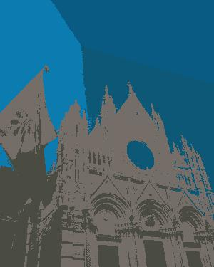

# Image Segmentation using [k-means clustering](https://en.wikipedia.org/wiki/K-means_clustering)

The program reads in an image, segments it using K-Means clustering and outputs the segmented image.

```python imageSegmentation.py K inputImageFilename outputImageFilename```

It is worth playing with the number of iterations, low numbers will run quicker.

The result is an over-segmented image. With the correct parameters, it can be used to partition an image for further processing.

## Output





